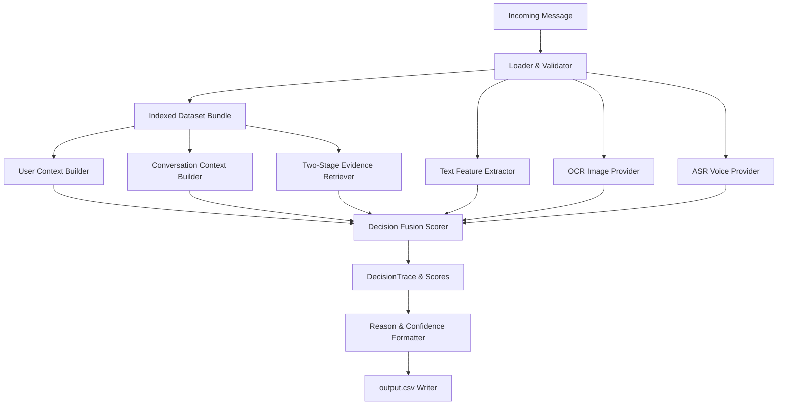

# Multimodal Message Notification Router

A production-grade, context-aware notification routing engine for WhatsApp that dynamically classifies incoming messages into `notify` (interrupt user now), `digest` (batch for later), or `mute` (silently suppress). 

The system leverages a modular, deterministic pipeline integrating user behavior profiles, thread context, historical interaction graphs, and multimodal features (text indicators, image OCR, and audio voice ASR).

---

## 1. Motivation
WhatsApp flows are noisy, combining critical personal alerts, business updates, event invites, marketing alerts, visual posters, and phishing threats. Conventional notification managers treat all feeds equally, leading to two poor outcomes: important notices get drowned out, and promotional or high-frequency alerts cause user fatigue.

This project solves this challenge by dynamically scoring and prioritizing each incoming message using personalized history profiles and content heuristics, routing messages to matching delivery actions.

---

## 2. Key Features

*   **Decoupled Multi-Factor Contexts**: Resolves thread status, sender trust indexes, group priorities, and Do-Not-Disturb (DND) boundaries in isolated domain modules.
*   **Two-Stage Evidence Retrieval**: Generates candidate history matches for the target user and ranks them via a recency-decay Jaccard index similarity score to identify consistent preferences.
*   **Multimodal Underpinnings**: Abstracs visual OCR and voice ASR features behind provider interfaces with offline JSON mapping caches.
*   **Deterministic scoring engine**: Segments priorities and enforces overrides (e.g., OTP codes bypass DND, spoofed phishing domains force muting).
*   ** calibarated Confidence Calibration**: Calculates decision confidence based on score margin boundaries, modality consistency, and historical actions.
*   **Integrated Submission Validator**: Performs post-write validations, enforcing column orders, categories, and float precision checks automatically.

---

## 3. System Architecture & Pipeline



### High-Level Execution Flow
1.  **Ingestion & Validation**: Parses CSV entries, checks constraints, and normalizes timestamps.
2.  **Context Resolution**: Gathers receiving user statistics and channel membership settings.
3.  **Retrieval Indexing**: Extracts similar historical messages to construct user reaction weights.
4.  **Feature Extraction**: Evaluates text urgency, domain links, OCR posters, and voice audio notes.
5.  **Override Resolution**: Evaluates phishing risks, business opt-outs, OTP codes, and DND states.
6.  **Scoring & Formatter**: Fuses weights, clamps confidence bounds to `[0.50, 1.00]`, and renders deterministic natural reasons.

---

## 4. Repository Structure

```text
whatsapp-notification-router/
├── docs/                        # Detailed architectural and design docs
│   ├── architecture.md          # Visual pipeline and data flows
│   ├── design_decisions.md      # Engineering rationales and tradeoffs
│   └── evaluation.md            # Testing strategy and schema validation rules
├── dataset/                     # Mock tables containing CSV message feeds
├── src/                         # Modular package code
│   ├── bootstrap.py             # Pre-flight environment initiator
│   ├── configs/                 # Path and threshold settings
│   ├── context/                 # User/Thread profile aggregates
│   ├── loader/                  # CSV parser and RFC 4180 validators
│   ├── models/                  # Immutable slots domain models
│   ├── multimodal/              # Text/Image/Audio extractors & providers
│   ├── output/                  # Reason templates and submission validators
│   ├── pipeline/                # Batch orchestration runner
│   ├── retrieval/               # Jaccard index similarity searches
│   ├── routing/                 # Rules priorities and override scorer
│   └── utils/                   # File IO and logging utilities
├── tests/                       # Unit and integration test suite
├── main.py                      # Production CLI runner
├── requirements.txt             # Minimal dependencies
└── README.md                    # Main documentation
```

---

## 5. Setup & Installation

Ensure you have Python 3.11 or later installed.

```bash
# Clone the repository
git clone https://github.com/yourusername/whatsapp-notification-router.git
cd whatsapp-notification-router

# Create virtual environment
python3 -m venv .venv
source .venv/bin/activate  # on Windows: .venv\Scripts\activate

# Install dependencies
pip install -r requirements.txt
```

---

## 6. Usage

Execute the message batch runner from the repository root:

```bash
# Process default dataset
python main.py

# Process custom dataset and redirect output destination
python main.py --dataset-dir /path/to/dataset --output /path/to/output.csv --log-level INFO
```

### CLI Options
*   `--dataset-dir PATH`: Override the directory path containing inputs.
*   `--output PATH`: Override target destination path for final predictions.
*   `--log-level LEVEL`: `DEBUG` | `INFO` | `WARNING` | `ERROR` (default: `INFO`).

---

## 7. Testing

The codebase includes a comprehensive suite of **191 unit and integration tests** executing in `<1.5 seconds`:

```bash
# Run pytest regression suite
python3 -m pytest tests/ -v
```

---

## 8. Summary of Engineering Decisions

*   **Deterministic Scoring Over ML Models**: Reduces runtime latency to `<10ms` per message while making predictions 100% reproducible and inspectable using `DecisionTrace` debug maps.
*   **Memory Optimization via `slots=True`**: Domain context dataclasses utilize standard Python `__slots__` arrays, bypassing mutable `__dict__` reference payloads and saving up to 60% memory overhead.
*   **Loose Media Coupling**: Encapsulating OCR and ASR pipelines behind factory providers isolates core routing from machine-dependent system binaries, allowing clean fail-safe cache fallbacks.

*Read [design_decisions.md](docs/design_decisions.md) for full engineering analyses.*

---

## 9. Limitations & Future Work

*   **Synonym Matches**: The Jaccard similarity index is purely token-based. Future integrations will feature lightweight, offline sentence embeddings (e.g. ONNX SentenceTransformers) to match synonyms.
*   **Distributed Caching**: Media transcripts currently cache locally on disk. Future iterations will introduce a distributed key-value store (e.g., Redis) for concurrent environments.

---

## 10. Acknowledgements & License
*   **Acknowledgements**: Originally designed as a prototype for the HackerRank Orchestrate Message Notification Router hackathon.
*   **License**: MIT License. See `LICENSE` for details.
