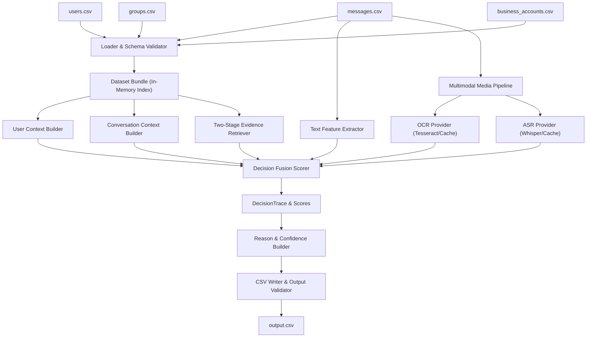
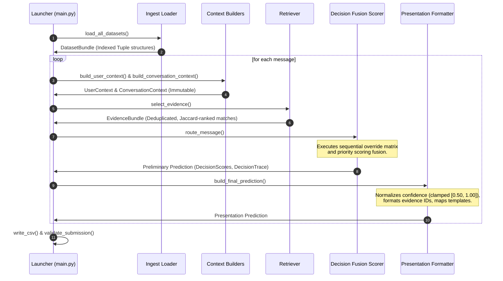
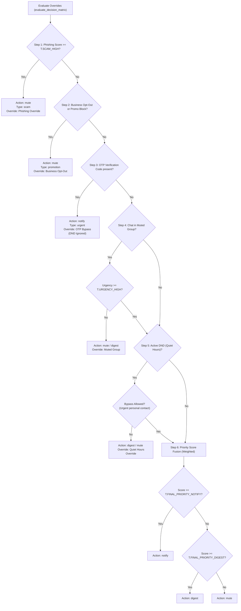

# System Architecture

The WhatsApp Message Notification Router is designed as a decoupled, top-down sequential pipeline to process incoming multimodal messages, resolve historical and relationship contexts, and determine routing priorities deterministically.

---

## 1. Overall System Architecture

The system utilizes modular pipeline components, separating state ingestion, feature extraction, scoring, and output generation.

---

## 2. Dynamic Data Flow

For every processed message, data flows sequentially through isolation boundaries. Context builders and retrievers populate immutable models, leaving the decision fusion scorer completely stateless.

---

## 3. Decision Override Pipeline

Priorities and override rules are evaluated sequentially in step boundaries to bypass priority scoring for high-certainty indicators.

---

## 4. Module Interaction Overview

Module boundaries isolate domains:

*   **Ingestion Layer (`src/loader/`)**: Loads CSV entries and validates data structures against column-level type maps. Coerces timestamps, formats, and handles RFC 4180 parsing.
*   **Context Layer (`src/context/`)**: Computes DND windows, sender trusts, opt-ins, and group membership summaries, returning immutable dataclasses.
*   **Retrieval Layer (`src/retrieval/`)**: Filters historical logs relative to receiving user identifiers and ranks candidate history via recency-decay Jaccard index similarity.
*   **Multimodal Layer (`src/multimodal/`)**: Exposes OCR and ASR providers, falling back to offline ground-truth JSON files.
*   **Scoring & Routing Engine (`src/routing/`)**: Runs overrides and calculates final scores.
*   **Presentation Layer (`src/output/`)**: Formats predictions and runs the final `SubmissionValidator`.
