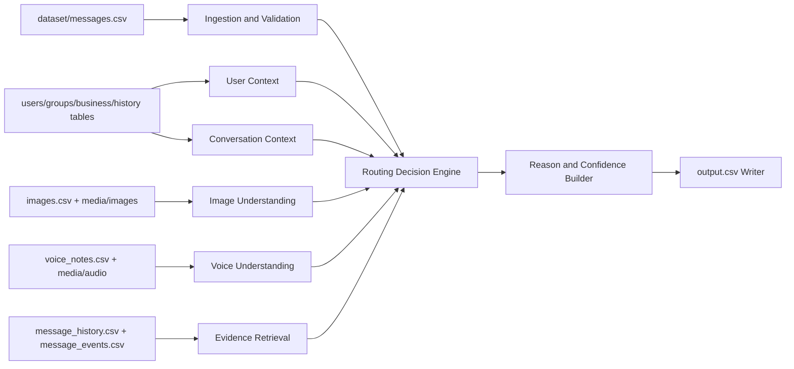

# Architecture

## Problem Overview

The task is to build an AI-powered WhatsApp message notification router that assigns every incoming message to one of three actions:

- `notify`: interrupt the user now
- `digest`: show later
- `mute`: suppress as low-value, repetitive, unwanted, suspicious, or unsafe

The system must reason over multimodal content, including text, images, and voice notes, while respecting user-specific preferences, conversation context, historical behavior, and business relationships.

## Design Goals

- Be deterministic and reproducible where possible.
- Make routing personalized to each recipient.
- Support multimodal input without depending on raw text only.
- Produce evidence-backed decisions with useful explanations.
- Keep the system modular so each component can be developed and tested independently.
- Preserve strict output formatting for submission.
- Avoid touching dataset files.

## High-Level Architecture

The system is organized into the following layers:

1. Dataset ingestion and validation
2. User context assembly
3. Conversation context assembly
4. Multimodal understanding
5. Historical evidence retrieval
6. Routing decision engine
7. Reason and confidence generation
8. Output writing
9. Logging, caching, and configuration support

### Component Interaction Diagram

## End-to-End Inference Pipeline

1. Load a row from `dataset/messages.csv`.
2. Validate schema, normalize identifiers, and resolve media references.
3. Build user-specific context from notification behavior, quiet hours, engagement history, and business relationships.
4. Build conversation-specific context from group membership, sender identity, business verification, and trust signals.
5. If the message is text-only, analyze the text directly.
6. If the message includes an image, resolve the image path and extract OCR/visual cues.
7. If the message includes a voice note, resolve the audio path and transcribe it.
8. Merge all modality signals into a single feature bundle.
9. Retrieve historical evidence from message history and message events.
10. Score routing candidates and choose `notify`, `digest`, or `mute`.
11. Assign the best-fit `message_type`.
12. Generate a short human-readable reason and calibrated confidence.
13. Emit `evidence_message_ids`.
14. Write one row to `output.csv`.
15. Repeat for every incoming message.

## Data Flow

### Primary Inputs

- `dataset/messages.csv`
- `dataset/users.csv`
- `dataset/groups.csv`
- `dataset/group_members.csv`
- `dataset/business_accounts.csv`
- `dataset/user_business_history.csv`
- `dataset/message_history.csv`
- `dataset/message_events.csv`
- `dataset/images.csv`
- `dataset/voice_notes.csv`
- `dataset/daily_notification_summary.csv`
- `dataset/sample_messages.csv`

### Media Inputs

- `dataset/media/images/`
- `dataset/media/audio/`

### Derived Data

- User context features
- Conversation context features
- OCR and transcript features
- Evidence rankings
- Routing scores
- Final output rows

## Cross-Cutting Concerns

### Logging

Logging should capture startup, validation, retrieval, modality processing, scoring, and output-writing events. The shared development transcript is stored outside the repository at `%USERPROFILE%\\hackerrank_orchestrate_august26\\log.txt` on Windows.

### Caching

Cache expensive artifacts such as OCR results, ASR transcripts, and retrieval indexes. Caching should not affect determinism.

### Configuration

Centralize paths, thresholds, feature toggles, and runtime settings in configuration files under `src/configs`.

### Testing

Validate each module independently before integrating it into the full pipeline. Start with schema validation and context builders, then add retrieval, multimodal processing, scoring, and end-to-end output tests.

### Error Handling

Missing media, malformed rows, failed OCR, failed ASR, and sparse history should degrade gracefully rather than stop the batch.

### Multimodal Processing

Text processing, OCR, and voice transcription should happen before routing so the decision engine receives normalized features rather than raw media.

## Notes

- Implementation should remain deterministic unless a module explicitly requires AI assistance.
- The final submission must write exactly one row per message in `dataset/messages.csv`.
- No organizer-only files should be used.
